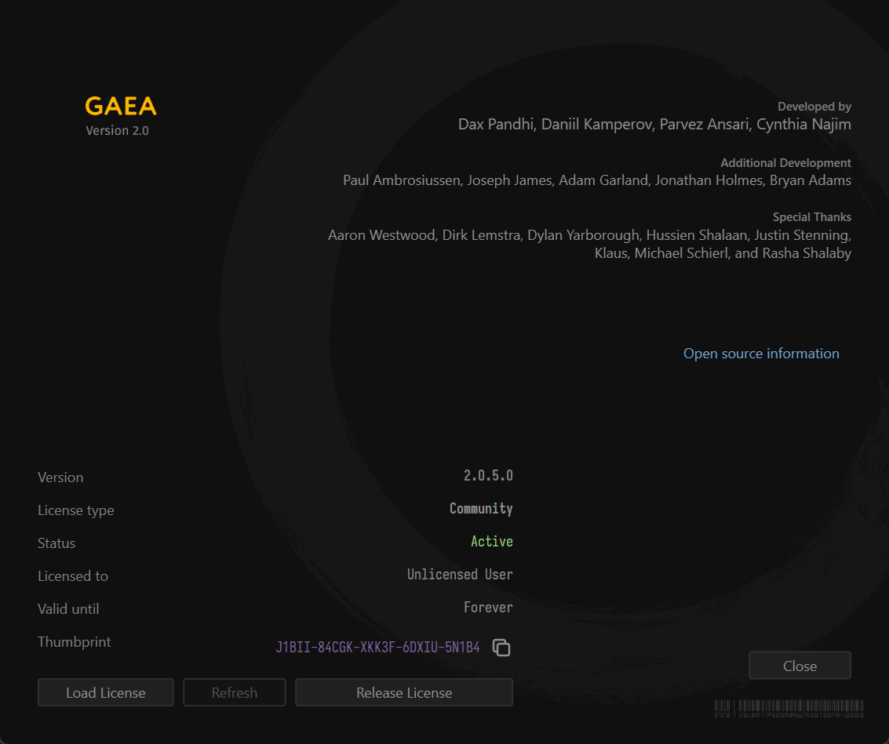

# Deactivation

## Releasing a License

You can release a license so it can be installed on a different computer. To do so, go to Help > About. Then click "Release License" at the bottom of the dialog. This will de-authorize the installation and revert it back to the Community Edition.

<figure></figure>

This is not a permanent deactivation. You can re-activate the same installation again if needed.

:::danger
You are allowed a limited number of activations per year and our server will disable licenses that show excessive activation activity to protect your license. If such an event occurs, you can contact technical support to request re-activation of your license.
:::

### Command Line Option

To deactivate from the command line, use the following syntax:

```
Gaea.exe -deactivate
```

