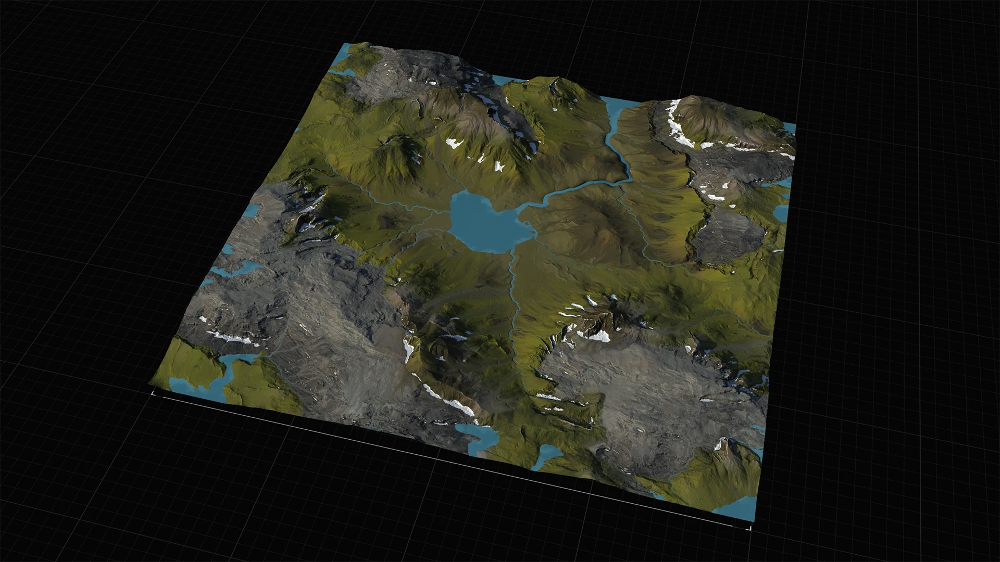
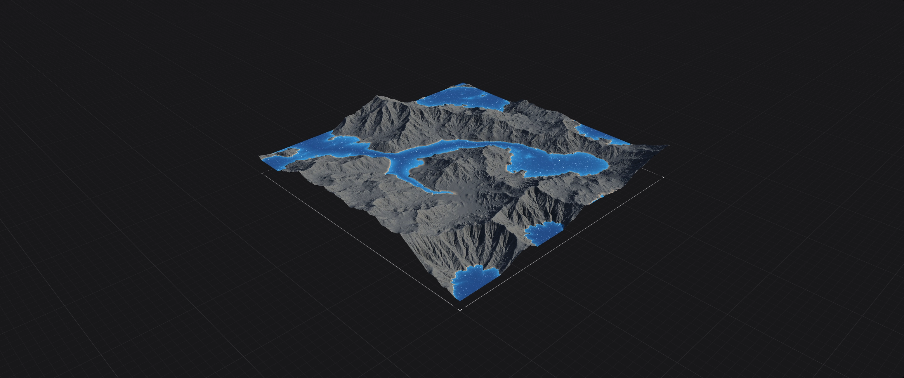
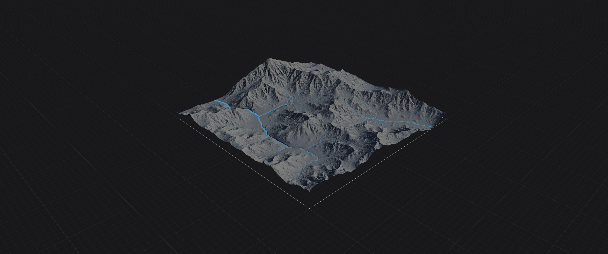
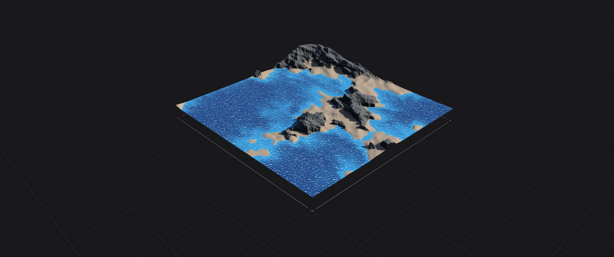

# Water

Create lakes, rivers, and even seas that follow physical rules, which not only produce a body of water, but also correspondingly affect the surrounding environment.

<figure></figure>

### Lakes

<figure></figure>

### Rivers

<figure></figure>

### Sea&#x20;

<figure></figure>

